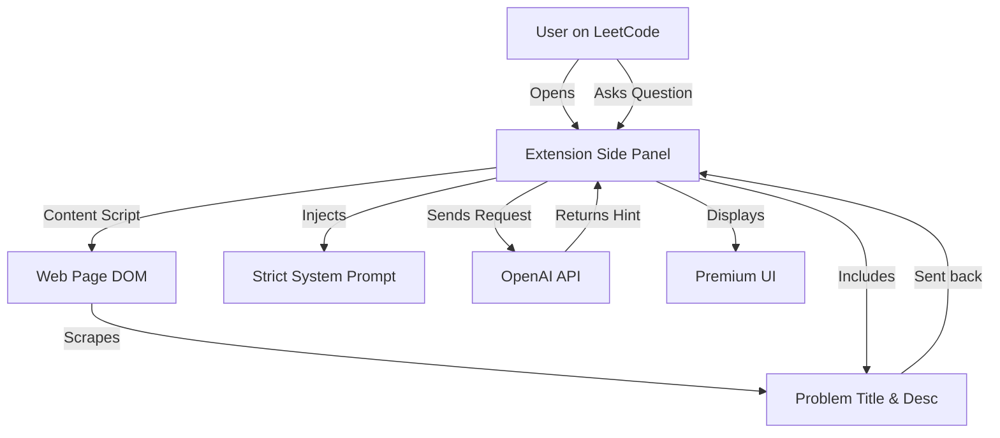

# 🎓 Student Buddy - AI DSA Mentor Extension


> **The ultimate "Socratic" mentor for LeetCode, GeeksforGeeks, and HackerRank.**  
> Student Buddy doesn't just give you the answer—it guides you to the solution, helping you master Data Structures and Algorithms.


---

## ⚡ Features

*   **🚫 Anti-Spoonfeeding**: Strictly follows a "Hint Escalation Ladder" to prevent giving easy answers.
*   **🧠 Problem Context Awareness**: Automatically detects the problem title and platform you are currently viewing.
*   **💡 Progressive Hints**: Ask for a hint, and get a small nudge. Ask again, get a bigger clue.
*   **🛠️ Pro Tools**:
    *   **Debug Mode**: Paste your code for a bug analysis without revealing the full fix.
    *   **Big-O Analysis**: Instantly check time/space complexity.
    *   **Similar Problems**: Get recommendations for pattern matching.
*   **🎨 Premium UI**: A dark-themed, glassmorphism interface that feels like a native app.

---

## 🏗️ Architecture

How does Student Buddy work?



---

## 🚀 Setup & Installation

Since this extension uses your personal API key, you need to set it up locally.

### 1. Clone the Repository
```bash
git clone https://github.com/yourusername/student-buddy.git
cd student-buddy
```

### 2. Configure API Key 🔑
To keep your key safe, we use a local secrets file that is ignored by Git.

1.  Find the file named `secrets.example.js` in the folder.
2.  Duplicate it (Coordinate Copy/Paste) and rename the copy to `secrets.js`.
3.  Open `secrets.js` in a text editor.
4.  Paste your OpenAI API Key inside:

```javascript
// secrets.js
const SECRETS = {
  OPENAI_API_KEY: "sk-proj-xxxxxxxxxxxxxxxxxxxxxxxx" 
};
```

> **IMPORTANT**: Never commit `secrets.js` to GitHub! (It is already in `.gitignore`).

### 3. Load into Chrome
1.  Open Chrome and navigate to `chrome://extensions`.
2.  Toggle **Developer Mode** (top right corner) to **ON**.
3.  Click the **Load Unpacked** button (top left).
4.  Select the `student-buddy` folder.
5.  Pin the 🧠 icon to your toolbar!

---

## 📖 Usage Guide

1.  **Navigate to a Problem**: Go to any problem on [LeetCode](https://leetcode.com).
2.  **Open Student Buddy**: Click the toolbar icon.
3.  **Check Status**: The top bar should show the problem name (e.g., *"LeetCode: Two Sum"*).
4.  **Interact**:
    *   Click **💡 Hint** for a small nudge.
    *   Click **⚡ Big-O** to understand complexity.
    *   Type a specific question like *"Why is my loop failing?"*.

---

## 🛠️ Tech Stack

*   **Frontend**: Vanilla HTML5, CSS3 (Glassmorphism), JavaScript (ES6+).
*   **Platform**: Chrome Extension Manifest V3.
*   **AI Backend**: OpenAI GPT-4 (via direct API call).

---

## 🐛 Troubleshooting

| Issue | Solution |
| :--- | :--- |
| **"Missing API Key" error** | Ensure you renamed `secrets.example.js` to `secrets.js` and added your key. |
| **"No supported problem detected"** | Refresh the web page and then click the "Refresh" icon in the extension. |
| **Extension looks broken** | Go to `chrome://extensions` and click the "Refresh" (circular arrow) icon on the card. |

---

## 🤝 Contributing

1.  Fork the repo.
2.  Create your feature branch (`git checkout -b feature/AmazingFeature`).
3.  Commit your changes (`git commit -m 'Add some AmazingFeature'`).
4.  Push to the branch (`git push origin feature/AmazingFeature`).
5.  Open a Pull Request.

---

Made with ❤️ by Student Buddy Team.
