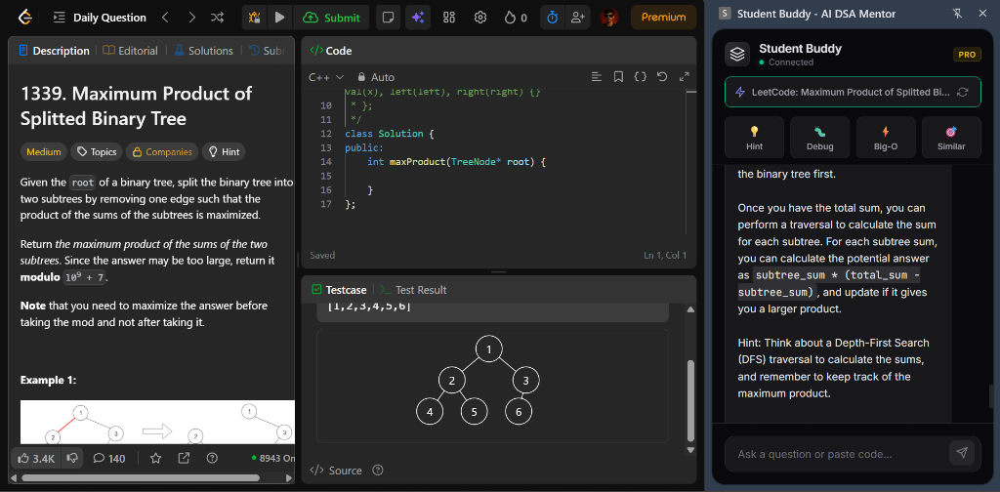
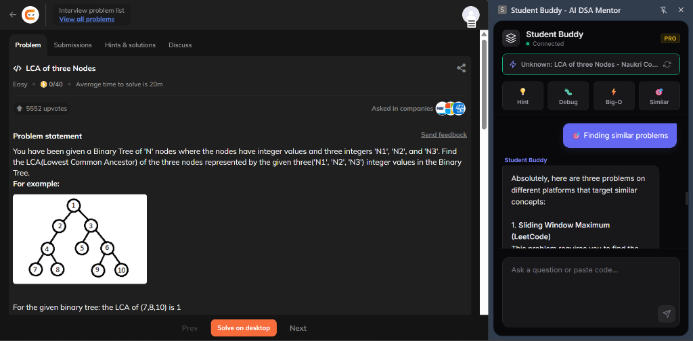
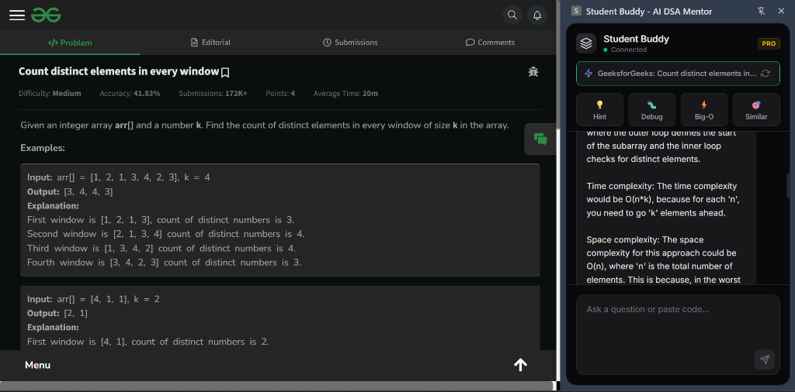
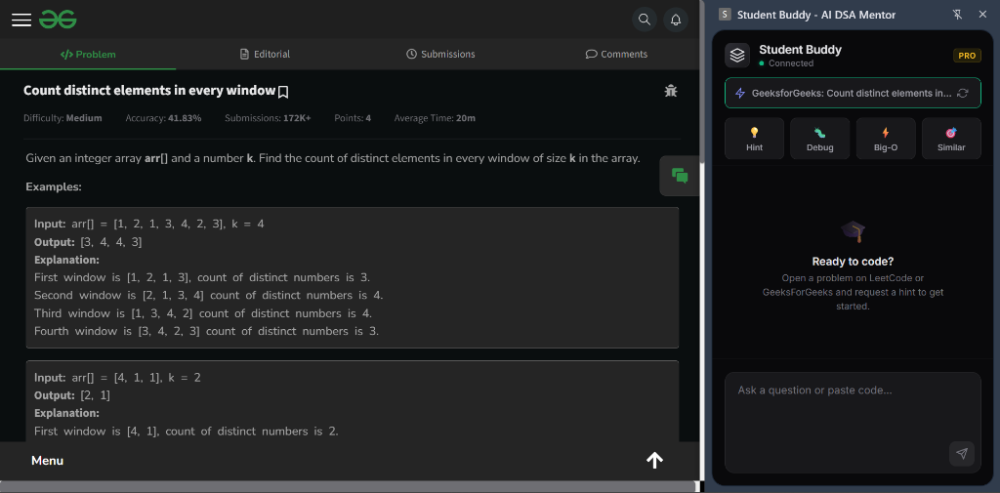
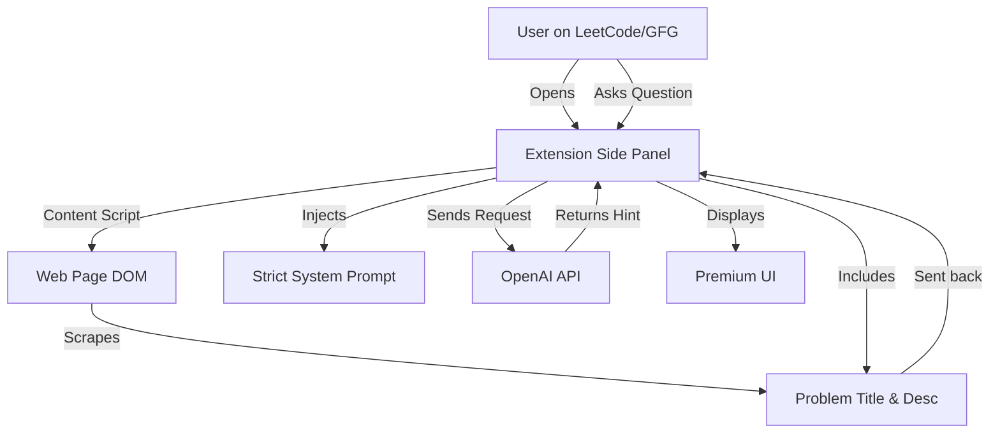

# 🎓 Student Buddy - AI DSA Mentor Extension

<div align="center">
  
  <h1>Student Buddy</h1>
  <p><strong>The ultimate "Socratic" mentor for your coding journey.</strong></p>

  [](LICENSE)
  [](manifest.json)
  [](https://chrome.google.com/webstore)

  <p>
    <i>Student Buddy doesn't just give you the answer—it guides you to the solution, helping you master Data Structures and Algorithms.</i>
  </p>
</div>

---

## 🌍 Supported Platforms

Student Buddy seamlessly integrates with the top coding platforms to help you wherever you practice:

| Platform | Support Status |
| :--- | :---: |
| **LeetCode** | ✅ Full Support |
| **GeeksforGeeks** | ✅ Full Support |
| **HackerRank** | ✅ Full Support |
| **Codeforces** | ✅ Full Support |
| **Naukri.com** | ✅ Full Support |

---

## 📸 Screenshots

Visualize your new coding workflow:

| **Intelligent Hinting** | **Problem Context Awareness** |
| :---: | :---: |
|  <br> *Get progressive hints without spoilers.* |  <br> *Smart detection on LeetCode.* |

| **Seamless Integration** | **Premium Chat Interface** |
| :---: | :---: |
|  <br> *Works perfectly on GeeksForGeeks.* |  <br> *Modern, dark-themed UI.* |

---

## ⚡ Key Features

*   **🚫 Anti-Spoonfeeding**: Strictly follows a "Hint Escalation Ladder" to prevent giving easy answers.
*   **🧠 Automatic Context**: Instantly detects the problem title, description, and platform you are currently viewing.
*   **💡 Progressive Hints**: 
    1.  **Nudge**: A gentle push in the right direction.
    2.  **Clue**: A more specific pointer about the logic.
    3.  **Strategy**: High-level approach without code.
*   **🛠️ Pro Tools**:
    *   **Debug Mode**: Paste your code for a bug analysis without revealing the full fix.
    *   **Big-O Analysis**: Instantly check time/space complexity.
    *   **Similar Problems**: Get recommendations for pattern matching.
*   **🎨 Premium Experience**: A sleek, dark-themed, glassmorphism interface that feels like a native part of your browser.

---

## 🏗️ Architecture

How does Student Buddy work under the hood?



---

## 🚀 Setup & Installation

Since this extension uses your personal API key, you need to set it up locally.

### 1. Clone the Repository
```bash
git clone https://github.com/yourusername/student-buddy.git
cd student-buddy
```

### 2. Configure API Key 🔑
To keep your key safe, we use a local secrets file that is ignored by Git.

1.  Find the file named `secrets.example.js` in the folder.
2.  Duplicate it (Copy/Paste) and rename the copy to `secrets.js`.
3.  Open `secrets.js` in a text editor.
4.  Paste your OpenAI API Key inside:

```javascript
// secrets.js
const SECRETS = {
  OPENAI_API_KEY: "sk-proj-xxxxxxxxxxxxxxxxxxxxxxxx" 
};
```

> **IMPORTANT**: Never commit `secrets.js` to GitHub! (It is already in `.gitignore`).

### 3. Load into Chrome
1.  Open Chrome and navigate to `chrome://extensions`.
2.  Toggle **Developer Mode** (top right corner) to **ON**.
3.  Click the **Load Unpacked** button (top left).
4.  Select the `student-buddy` folder.
5.  Pin the 🧠 icon to your browser toolbar!

---

## 📖 Usage Guide

1.  **Navigate to a Problem**: Go to any supported platform (e.g., [LeetCode](https://leetcode.com)).
2.  **Open Student Buddy**: Click the pin icon in your toolbar to open the side panel.
3.  **Check Status**: The top bar should show the problem name (e.g., *"LeetCode: Two Sum"*).
4.  **Interact**:
    *   Click **💡 Hint** for a small nudge.
    *   Click **⚡ Big-O** to understand complexity.
    *   Type a specific question like *"Why is my loop failing?"*.

---

## 🛠️ Tech Stack

*   **Frontend**: HTML5, CSS3 (Glassmorphism), JavaScript (ES6+).
*   **Platform**: Chrome Extension Manifest V3 (Side Panel API).
*   **AI Backend**: OpenAI GPT-4o / GPT-4-turbo (configurable).

---

## 🐛 Troubleshooting

| Issue | Solution |
| :--- | :--- |
| **"Missing API Key" error** | Ensure you renamed `secrets.example.js` to `secrets.js` and added your actual key. |
| **"No supported problem detected"** | Refresh the web page and then click the "Refresh" icon in the extension header. |
| **Extension UI looks broken** | Go to `chrome://extensions` and click the "Refresh" (circular arrow) icon on the card to reload the code. |

---

## 🤝 Contributing

We welcome contributions!

1.  Fork the repo.
2.  Create your feature branch (`git checkout -b feature/AmazingFeature`).
3.  Commit your changes (`git commit -m 'Add some AmazingFeature'`).
4.  Push to the branch (`git push origin feature/AmazingFeature`).
5.  Open a Pull Request.

---

<div align="center">
  <p>Made with ❤️ by the Student Buddy Team</p>
</div>
